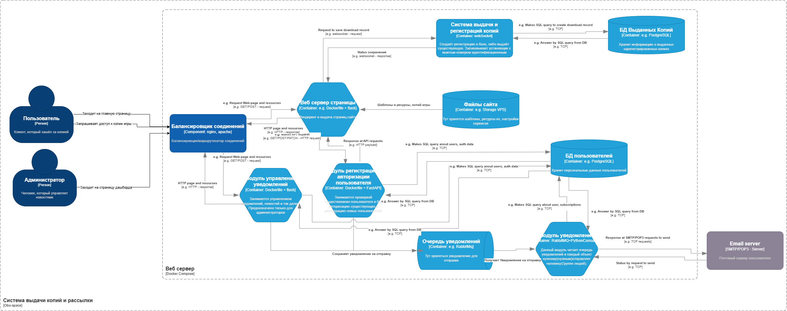
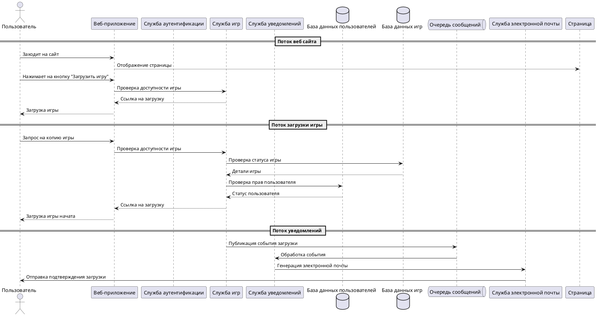
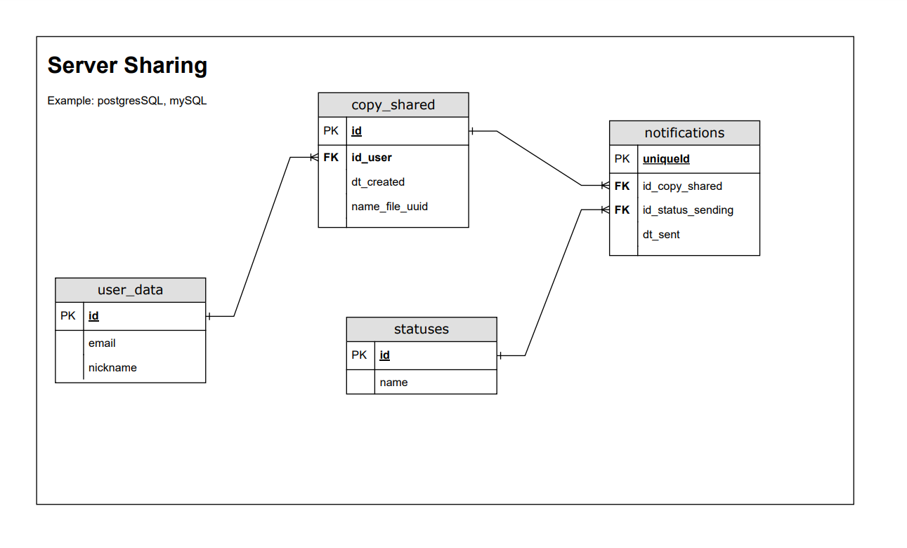
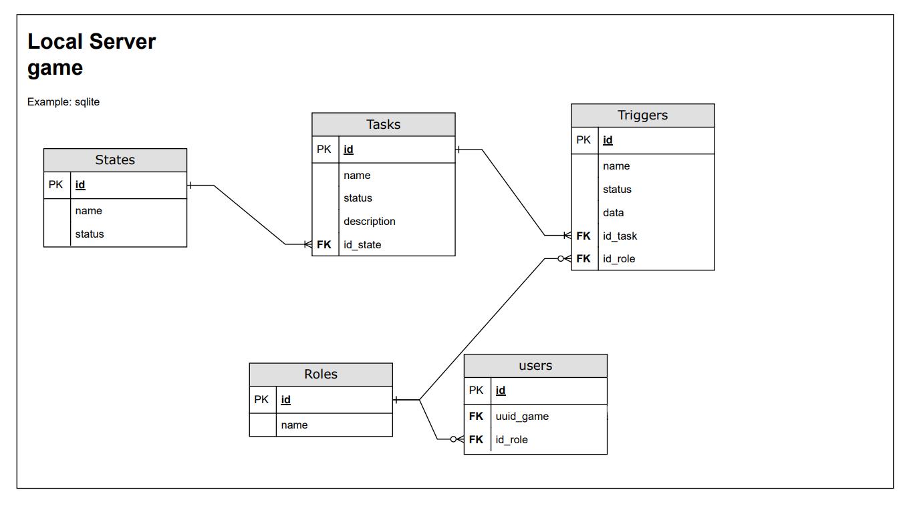

# obo-space-web
Это веб-сайт для распространения информации о проекте obo-space.

## Структура проекта

- `main.py` - основной файл для запуска приложения
- `blueprints` - директория для хранения блюпринтов
- `Dockerfile` - файл для сборки Docker-образа
- `requirements.py` - файл для хранения зависимостей

# UML диаграмма

## C4 диаграмма

## Диаграмма последовательности

Диаграмма последовательности

## ERD диаграмма БД
### Веб-сервер

### Локальный сервер игры

